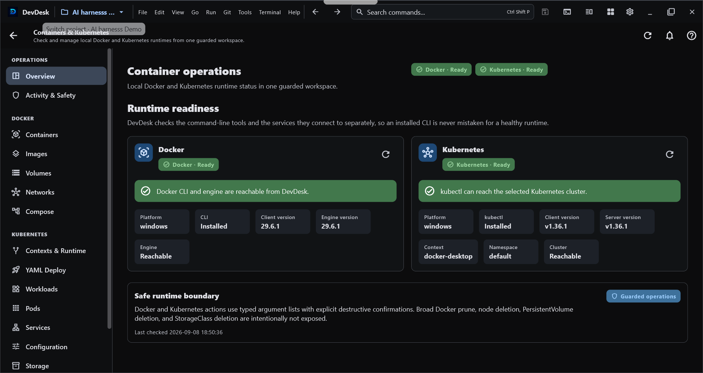
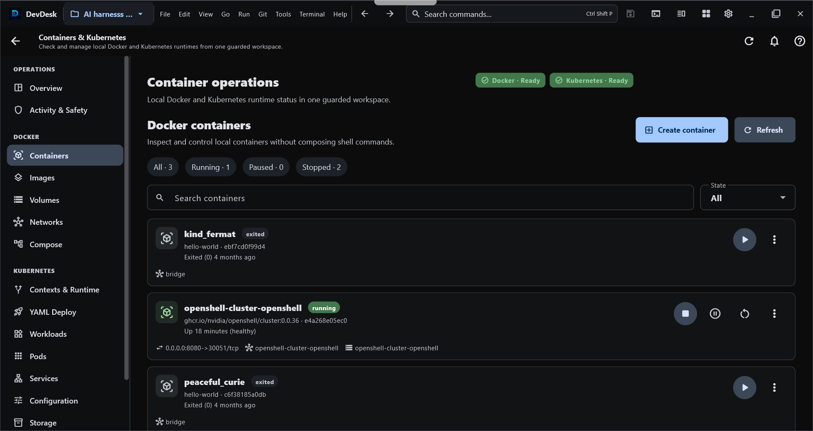

# Containers & Kubernetes

DevDesk **Containers & Kubernetes** is a workspace-aware desktop operations surface for Docker, Docker Compose, and Kubernetes. It is designed so a user who does not live in terminals can still understand runtime state, create or operate workloads from a GUI, and see why an action is blocked before a destructive command runs.

<section class="container-manual-gallery" aria-label="Real DevDesk Containers and Kubernetes interface">
<h2>Real interface</h2>

These screenshots show real DevDesk container-management surfaces. The current manual below also covers newer application, cluster, compatibility, troubleshooting, and safety workflows that may not all appear in these two captures.

<figure class="container-product-shot">

<figcaption><strong>Runtime readiness</strong>Docker engine and Kubernetes cluster health, versions, context, namespace, and guarded operations.</figcaption>
</figure>
<figure class="container-product-shot">

<figcaption><strong>Docker containers</strong>Search, filter, create, and control containers without leaving the active workspace.</figcaption>
</figure>

</section>

## Start from a workspace

Open a project and choose **Containers & Kubernetes** from its project tools. The tool receives the selected workspace context, so operations stay connected to the project you are already using instead of silently switching to unrelated files or runtime state.

Local Docker and `kubectl` execution is a desktop capability and requires explicit execution trust. Opening a project or viewing the manual does not run Docker, `kubectl`, kind, minikube, Compose, or a shell command automatically.

## Runtime Doctor and Setup Center

Use **Overview / Runtime Doctor** before debugging an application. DevDesk separates tool installation problems from runtime problems and can report the readiness of:

- Docker CLI and Docker Engine;
- `kubectl`;
- kubeconfig and the selected Kubernetes context;
- Kubernetes API reachability;
- selected namespace;
- read-only RBAC checks;
- kind or minikube when a local-cluster workflow needs them;
- detected version compatibility.

If Docker is not installed, the engine is stopped, `kubectl` is missing, a context is stale, or the cluster cannot be reached, DevDesk shows that state as a product-level problem instead of presenting only raw command output.

DevDesk does not silently install Docker, `kubectl`, kind, or minikube for you.

## Capability-driven navigation

The sidebar is derived from the capabilities that are actually available on the current device and runtime. A feature can be:

- available and enabled;
- visible but disabled with a reason because its runtime is not ready;
- hidden when the platform cannot support it;
- disabled by a validated compatibility rule when a known tool/version combination is unsafe or unsupported.

A compatibility file cannot force-enable a capability that the current platform or runtime does not provide.

## Docker Applications

**Docker → Applications** is the beginner-friendly application view.

- A Docker Compose project is shown as one logical application rather than as a pile of unrelated containers.
- Compose-managed containers are not duplicated as standalone applications.
- Standalone containers appear as their own application cards.
- Scaled Compose services are evaluated by distinct services, while total container count remains visible separately.
- Common application actions include Start, Stop, Restart, Logs, Inspect, and Compose lifecycle actions where applicable.

The lower-level **Containers**, **Images**, **Volumes**, **Networks**, and **Compose** screens remain available for users who need direct resource control.

## Create a Docker container from the GUI

Choose **Docker → Containers → Create container**. The canonical wizard provides **Simple** and **Advanced** paths so a beginner can start with image/name/ports while an experienced user can add supported options deliberately.

DevDesk uses Docker's create-then-start model:

1. validate the requested configuration;
2. create the container;
3. optionally start it when **Start after creation** is enabled;
4. refresh the authoritative Docker view.

If creation succeeds but startup fails, DevDesk preserves the created container and reports the partial result. It does not silently delete the resource you just created.

Deletion remains explicit. Built-in Docker networks such as `bridge`, `host`, and `none` are protected from the ordinary delete path.

## Docker Compose projects

Compose project operations stay connected to the selected workspace. DevDesk can show the project as one application while retaining the lower-level Compose surface for direct control.

High-impact actions are separate:

- **Down** requires the intended project identity;
- removing Compose volumes is a separate destructive acknowledgement;
- logs or inspection failures are surfaced instead of disappearing silently.

## Create a local Kubernetes cluster

Choose **Kubernetes → Clusters → Create cluster** for the guided local-cluster wizard.

The provider architecture is capability-based rather than hard-coded into the UI:

- **kind** supports its actual create/list/delete capability set;
- **minikube** supports create/list/start/stop/delete plus its supported resource sizing controls;
- DevDesk does not pretend a provider supports actions it does not expose;
- duplicate cluster/profile names are checked before mutation;
- cluster names are validated before command execution.

The wizard walks through provider selection, configuration, review, create, context activation, and Kubernetes API readiness. If cluster creation succeeds but a later context/readiness check fails, DevDesk preserves the created cluster and reports that verification needs attention instead of deleting the cluster automatically.

Cluster deletion requires exact-name confirmation.

## Kubernetes Applications

**Kubernetes → Applications** composes lower-level resources into a logical application view while keeping the raw resource screens available.

DevDesk correlates resources from Kubernetes metadata rather than guessing from name prefixes:

- workload selectors and pod-template labels → Pods;
- `matchLabels` and supported `matchExpressions` → matching Pods;
- Service selectors → application Pods;
- EndpointSlice metadata → Services;
- Ingress backends → Services;
- pod owner references → managed controller/event relationships;
- exact resource identities → relevant Warning events.

The application view can summarize health as **Healthy**, **Progressing**, **Warning**, **Critical**, or **Unknown** from observed Kubernetes state.

## Guided Kubernetes troubleshooting

The troubleshooting engine is deterministic. It does not invent an AI diagnosis from free-form command output. It maps observed Kubernetes state to known problem classes such as:

- `CrashLoopBackOff`, `BackOff`, and `OOMKilled`;
- `ImagePullBackOff`, `ErrImagePull`, and related image-pull failures;
- unschedulable Pods;
- container configuration/create failures;
- failed container exits or failed Pods;
- readiness failures;
- workload replica shortages;
- `ProgressDeadlineExceeded` or other failed controller conditions;
- failed Jobs;
- required ConfigMap or Secret metadata that is missing;
- Services with no matching or ready application backends;
- relevant Kubernetes Warning events.

Historical `lastState` data is not treated as a current crash after a container has recovered. Likewise, DevDesk avoids absence-based diagnoses when the relevant Pods, configuration, network, or Events collection could not be read successfully.

Guided actions reuse the normal guarded operation paths, including Describe, Rollout Status, Restart, Scale, Logs, Previous Logs, and Terminal where supported.

## Deploy App without writing YAML first

Choose **Kubernetes → Deploy App** for the visual application builder. The form can describe:

- container image;
- replicas;
- container and Service ports;
- environment values;
- CPU and memory requests/limits;
- readiness and liveness probes;
- optional Service exposure.

DevDesk generates standard Deployment and optional Service YAML and shows the generated manifest for review before mutation. The visual builder does not hide declarative configuration from you.

Do not place real secrets in ordinary environment-value fields. DevDesk does not generate Kubernetes Secret values from this beginner form.

## Advanced Kubernetes resource areas

The raw resource architecture stays split so one busy collection does not become a monolithic state controller. Current areas include:

- Workloads;
- Pods;
- Network;
- Configuration;
- Storage;
- Nodes;
- Events.

Common diagnostics and mutations use a shared coordination layer. Context or namespace changes invalidate the relevant cached collections, and stale requests are prevented from overwriting the newly selected identity.

High-impact resource types such as Node, PersistentVolume, and StorageClass are protected from the ordinary delete workflow. Other resource deletion requires explicit confirmation.

## Safe YAML deployment transaction

Both workspace YAML deployment and the visual Deploy App builder share a guarded deployment workflow:

1. client-side validation;
2. Kubernetes server dry-run;
3. diff;
4. apply after explicit confirmation;
5. bounded rollout verification;
6. optional workload recovery when explicitly enabled.

DevDesk does **not** claim that arbitrary Kubernetes Apply is an atomic transaction. Optional automatic recovery is limited to rollout-capable workloads such as Deployment, StatefulSet, and DaemonSet revisions. Service, ConfigMap, Secret, PVC, and other unrelated manifest changes are reported as non-rollbackable rather than being silently deleted or recreated.

Automatic `--force-conflicts` is not used.

If a rollout verification fails and recovery is enabled, DevDesk can attempt a workload-scoped rollout undo and report full, partial, or failed recovery without hiding the original deployment failure.

## Context, namespace, and RBAC guard

Before guarded Kubernetes operations, DevDesk checks that the runtime still matches the selected **context** and, for namespaced work, the selected **namespace**.

For supported operations it also performs a read-only `kubectl auth can-i --quiet` preflight for the required verb/resource or subresource. Examples include:

- `get` for inspection;
- `delete` for deletion;
- `patch` for supported rollout restart paths;
- `update` on a workload scale subresource;
- `get` on the Pod log subresource;
- `create` on the Pod exec subresource;
- `get secrets` before an explicit Secret reveal.

A failed or unavailable authorization check fails closed for the guarded action. DevDesk does not use Kubernetes impersonation flags such as `--as`, `--as-group`, or `--as-uid` in this workflow.

Secret values remain behind an explicit reveal action and are not copied into ordinary application summaries or durable activity records.

## Unified Operation Engine

Docker and Kubernetes mutation controllers share a central operation engine for cross-screen safety.

It provides:

- operation keys and conflict/exclusivity groups;
- duplicate/conflicting mutation blocking;
- bounded caller-facing timeouts;
- normalized failures;
- stale Kubernetes identity detection;
- unified activity lifecycle records.

A timeout returned to the UI does not immediately release a conflicting-operation lock while the underlying Docker or Kubernetes future is still running. The lock remains until that underlying operation settles, preventing a second mutation from racing the first one on the same protected target.

Local per-screen busy indicators remain as UI feedback, while the shared engine coordinates the actual cross-controller conflict boundary.

## Activity & Safety

The Activity & Safety center keeps a bounded local history of operation metadata such as action, target, scope, runtime, safety class, status, timestamps, and user-safe failure information.

It deliberately avoids persisting:

- stdout or stderr;
- environment values;
- kubeconfig credentials;
- Kubernetes Secret values;
- raw technical details that may contain sensitive data.

If DevDesk restarts while a persisted operation still says **running**, that old record is recovered as an interrupted operation rather than being shown as permanently active.

## Compatibility Center and Compatibility Packs

Use **Compatibility** to inspect detected runtime versions and compatibility decisions. DevDesk can evaluate Docker CLI/Engine, `kubectl`, Kubernetes server, kind, and minikube versions.

Compatibility Packs are small JSON or YAML **data files**, not plugins or scripts. A validated pack can describe supported version ranges, warnings, feature disables, safe resource aliases, and narrowly bounded argument substitutions for known DevDesk-owned operations.

Security boundaries:

- a pack cannot choose an executable or arbitrary subcommand chain;
- shell/PowerShell/script execution is not supported;
- dangerous or identity-changing flags are rejected;
- kubeconfig/context/namespace/file-target/credential/certificate injection is blocked;
- an unverified local pack cannot alter mutation-operation flags;
- signed packs can be verified with Ed25519 against a public key that the user explicitly trusts;
- DevDesk does not invent a trusted publisher key for you.

This design lets many future Docker/Kubernetes CLI compatibility changes be handled as validated data while still requiring a real DevDesk update for fundamental protocol, security, authentication, or architectural changes.

## Beginner workflows

### I only want to run one Docker container

1. Open **Containers & Kubernetes**.
2. Check Runtime Doctor until Docker Engine is ready.
3. Open **Docker → Containers → Create container**.
4. Enter the image and only the options you understand.
5. Review the configuration and create it.
6. Use **Docker → Applications** for the simpler application-level view.

### I want a local Kubernetes cluster

1. Check that `kubectl` and your chosen provider are available.
2. Open **Kubernetes → Clusters → Create cluster**.
3. Choose kind or minikube according to the capabilities shown.
4. Review the cluster configuration.
5. Create the cluster and let DevDesk activate/verify the context.
6. If verification needs attention, keep the created cluster and use Runtime Doctor instead of recreating it blindly.

### I want to deploy an application

1. Confirm the intended context and namespace.
2. Use **Deploy App** for the visual builder, or choose workspace YAML.
3. Review generated/configured YAML.
4. Read validation, server dry-run, and diff results.
5. Confirm Apply.
6. Follow rollout verification and Activity & Safety.

### My Kubernetes app is unhealthy

1. Open **Kubernetes → Applications**.
2. Read the health summary and deterministic finding.
3. Start with Describe, Logs, Previous Logs, or Rollout Status as suggested.
4. Fix the underlying image/config/scheduling/readiness problem.
5. Restart or scale only when the evidence supports that action.

## Common problems

| What you see | What to check first |
| --- | --- |
| Docker unavailable | Docker CLI installation and Docker Engine state in Runtime Doctor |
| `kubectl` unavailable | `kubectl` installation and PATH |
| Cluster unreachable | selected context, kubeconfig, API reachability, network/VPN |
| Wrong namespace | current namespace in the Kubernetes header/Runtime Doctor |
| Permission denied | RBAC preflight result and the required verb/resource |
| Image pull failure | image reference, registry access, and Pod events |
| Crash loop | Previous Logs, Pod Describe, exit reason, OOM state |
| Service has no ready backend | Service selector and Pod readiness |
| Apply succeeded but rollout failed | rollout details; optional workload recovery if deliberately enabled |
| Compatibility Pack rejected | schema, size, blocked fields/flags, signature/trust state |
| Operation already running | Activity & Safety; wait for the underlying protected operation to settle |

See [Troubleshooting](troubleshooting.html) for recovery steps shared with the rest of DevDesk.

## Desktop and Android boundary

Local Docker, Docker Compose, `kubectl`, kind, and minikube execution requires a supported desktop runtime. The same DevDesk product or entitlement can be recognized on Android, but this release does **not** claim that Android runs a local Docker/Kubernetes runtime or that DevDesk provides a remote container-control service.

## Access and monetization

Containers & Kubernetes belongs to DevDesk's advanced Builder capability set. Access can be provided by the applicable Builder entitlement or an All Access entitlement according to the current store/app configuration. This manual does not replace the live offer or pricing shown by the app/store.

## Safety checklist

1. Confirm the workspace before opening container operations.
2. Confirm Docker runtime readiness before changing containers.
3. Confirm Kubernetes context **and namespace** before cluster mutations.
4. Read RBAC/preflight failures instead of bypassing them externally.
5. Review generated YAML, server dry-run, and diff before Apply.
6. Keep automatic recovery opt-in; understand what Kubernetes resources are not rollbackable.
7. Treat delete confirmations as final identity checks.
8. Import Compatibility Packs only from sources you understand; trust signing keys deliberately.
9. Never place credentials or Secret values in compatibility files or ordinary app-builder environment fields.
10. Review **Activity & Safety** after mutations and before assuming refreshed state is current.
