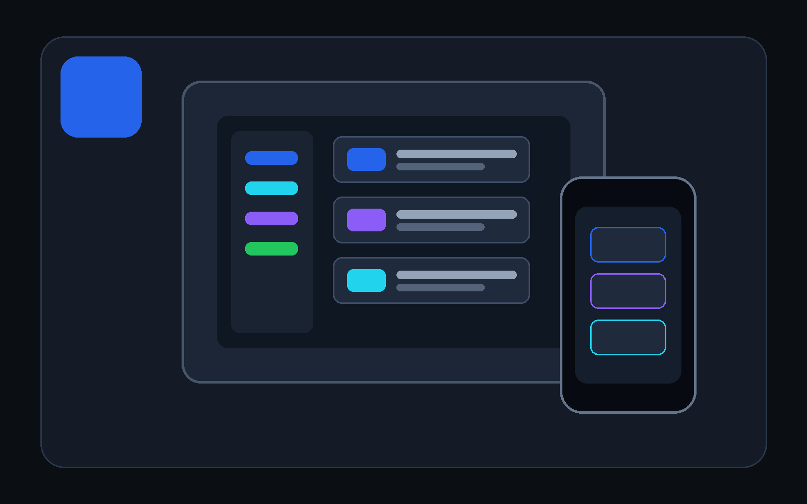

# Getting started with DevDesk

DevDesk is a local developer workspace for Markdown knowledge, API testing, OpenAPI files, local Git inspection, and practical developer utilities. It is designed to keep ordinary files portable and understandable rather than locking your work into a proprietary cloud database.

<div class="hero-inline"><div><strong>Your first goal</strong><p>Open an existing project folder, connect a few Markdown notes, inspect the graph, and send one safe test API request.</p></div></div>

## First launch

1. Read the privacy notice and acknowledge it.
2. Complete or skip the onboarding tour.
3. Open **Developer Workspaces**.
4. Register a folder that contains Markdown documentation, or create a small practice folder using the commands below.
5. Open the workspace and let DevDesk index headings, tags, properties, links, backlinks, issues, and graph relationships.
6. Open **Structured Knowledge** only when you want to analyze or prepare an OKF-compatible bundle.
7. Use the **Help** icon inside any tool to open the matching manual topic.

> [!NOTE] DevDesk does not upload a project folder to a DevDesk-operated server. Sending an API request, checking a link, fetching supported GitHub content, or opening an external page is still a network action.

## Create a safe practice folder

### Windows PowerShell

```powershell
$root = "$HOME\Documents\DevDesk-Practice"
New-Item -ItemType Directory -Force $root | Out-Null
New-Item -ItemType Directory -Force "$root\architecture", "$root\api", "$root\runbooks" | Out-Null
@"
# DevDesk Practice Workspace

Start with [System Architecture](architecture/system-architecture.md).
"@ | Set-Content -Encoding utf8 "$root\index.md"
```

### macOS or Linux terminal

```bash
root="$HOME/Documents/DevDesk-Practice"
mkdir -p "$root"/{architecture,api,runbooks}
cat > "$root/index.md" <<'EOF'
# DevDesk Practice Workspace

Start with [System Architecture](architecture/system-architecture.md).
EOF
```

Then select the new folder in **Developer Workspaces**.

## Choose the right tool

| What you want to do | Start here |
|---|---|
| Work directly with a project folder | Developer Workspaces |
| Edit one Markdown file | Markdown Editor |
| Keep personal linked notes inside DevDesk | Markdown Vault |
| Build a saved API collection | API Workspaces |
| Send one quick request | Quick API |
| Inspect an OpenAPI file | OpenAPI Studio |
| Convert or inspect developer data | Explore all tools |

## Platform behavior

- **Android:** compact single-column layouts, sheets, touch-sized actions, and support for portrait, landscape, split-screen, and freeform windows.
- **Windows:** persistent navigation and multi-panel workspaces when enough width is available. Resize the window to collapse optional panels.
- **macOS:** the current published release is not offered for macOS. The website keeps a macOS download card visible as a transparent availability notice rather than presenting a false download.
